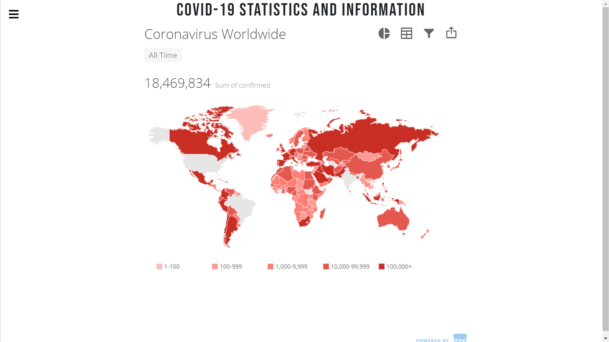
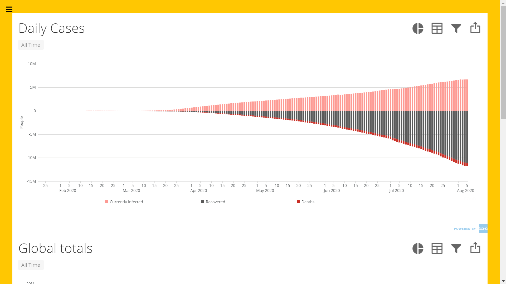
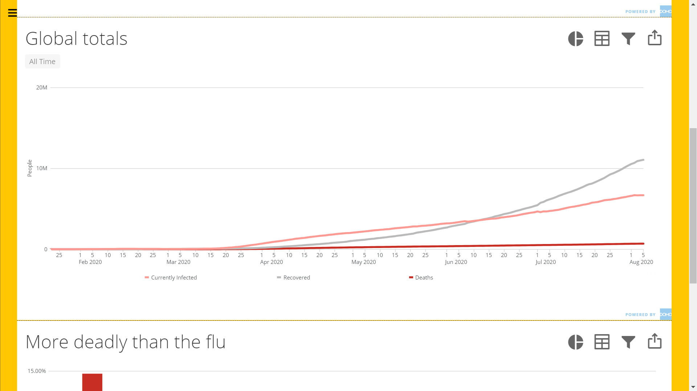
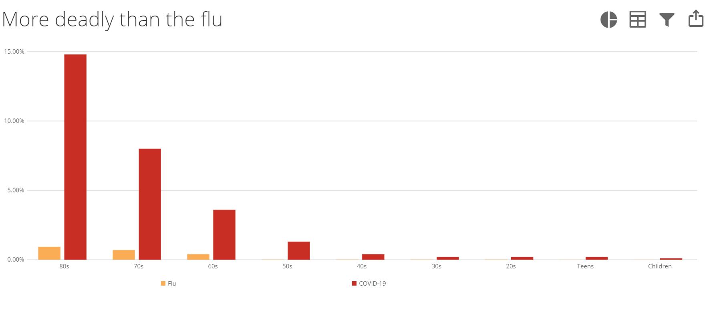

# Covid-19 Tracker

A simple tracker I built in my free time to track the Covid-19 pandemic statistics

## Languages and Technologies

 

## GLOBAL STATS

  

## COMPARISON GRAPHS 1

  

## COMPARISON GRAPHS 2

  

## COMPARISON GRAPHS 3

  

